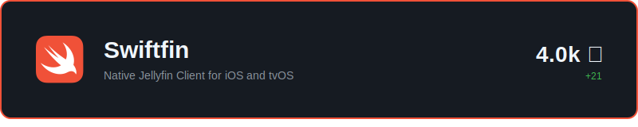
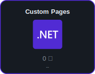
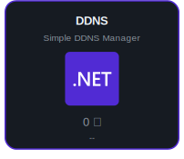
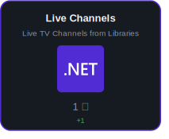
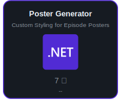
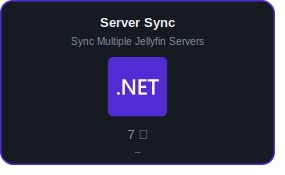
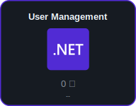
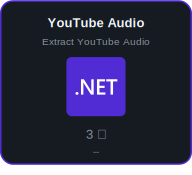

<!--
  Layout notes:
  - Every gap (vertical and horizontal) is exactly 10px, baked into the SVGs
    as transparent padding: cards carry a 10px bottom pad (except the footer)
    and a 10px right pad (except the last card of each row).
  - Rows use 
 (no margins, unlike 
) and images are butted together
    with zero whitespace so widths are exact; each row sums to 800px.
  - align="top" (vertical-align: top) collapses each row's line box to the
    image height, removing the font-descent gap that default baseline
    alignment adds below each row. Note: the legacy align="bottom" maps to
    vertical-align: baseline, which does NOT remove it.
  - Responsive: every card is a <picture> whose <source media="(max-width:
    1011px)"> swaps in a full-width 800px "-mobile" variant with larger type.
    Below GitHub's lg breakpoint (1012px) the profile content column drops
    under 800px and the fixed-width rows would wrap raggedly, so narrow
    viewports (including the mobile app) instead get a uniform stack of
    full-width cards, each still individually linked. Mobile cards bake a
    20px transparent bottom pad (footer excepted), which at half scale
    matches the desktop 10px gaps.
-->

<a href="https://joseph.kribs.net"><picture><source media="(max-width: 1011px)" srcset="cards/header-mobile.svg"></picture></a>

<a href="https://github.com/jellyfin/Swiftfin"><picture><source media="(max-width: 1011px)" srcset="cards/swiftfin-mobile.svg"></picture></a>

<a href="https://github.com/JPKribs/jellyfin-plugin-custompages"><picture><source media="(max-width: 1011px)" srcset="cards/custompages-mobile.svg"></picture></a><a href="https://github.com/JPKribs/jellyfin-plugin-ddns"><picture><source media="(max-width: 1011px)" srcset="cards/ddns-mobile.svg"></picture></a><a href="https://github.com/JPKribs/jellyfin-plugin-livechannels"><picture><source media="(max-width: 1011px)" srcset="cards/livechannels-mobile.svg"></picture></a>

<a href="https://github.com/JPKribs/jellyfin-plugin-episodepostergenerator"><picture><source media="(max-width: 1011px)" srcset="cards/poster-mobile.svg"></picture></a><a href="https://github.com/JPKribs/jellyfin-plugin-serversync"><picture><source media="(max-width: 1011px)" srcset="cards/sync-mobile.svg"></picture></a><a href="https://github.com/JPKribs/jellyfin-plugin-usermanagement"><picture><source media="(max-width: 1011px)" srcset="cards/usermgmt-mobile.svg"></picture></a><a href="https://github.com/JPKribs/jellyfin-plugin-youtubeaudio"><picture><source media="(max-width: 1011px)" srcset="cards/youtube-mobile.svg"></picture></a>

<a href="https://joseph.kribs.net"><picture><source media="(max-width: 1011px)" srcset="cards/footer-mobile.svg"></picture></a>

